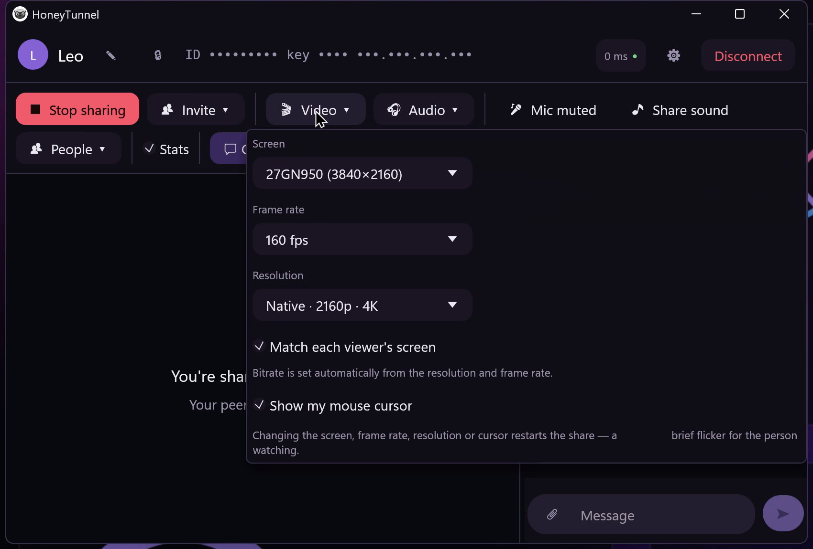
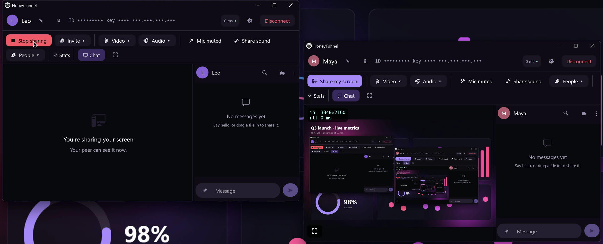

# HoneyTunnel

### Share your screen, your voice and your files: straight from your PC to theirs.

**No accounts. No servers. Nothing in the middle.**

[**See it in action**](#see-it-in-action) &nbsp;·&nbsp; [**What you get**](#what-you-get) &nbsp;·&nbsp; [**Private by design**](#private-by-design) &nbsp;·&nbsp; [**Get access**](#get-access)

 

https://github.com/user-attachments/assets/450ad874-70fa-41a2-baf1-2d1e52fbe1b7
Real capture, not a mock-up. One PC plays both host (Maya) and guest (Leo), sharing its 3840×2160 screen to itself, so the nested windows are the tunnel effect of watching your own screen.

 

## Why HoneyTunnel

Most screen sharing tools send your screen to somebody else's servers first. HoneyTunnel doesn't have any. **One of the two computers is the server**, so your screen, your voice, your chat and your files travel directly between you and the people you invite. Nobody can decrypt it or watch it go by.

|  |  |
|---|---|
| 🔒 **Private by construction** | Encrypted end to end. No relay, no account, no telemetry. |
| 🖥️ **Built for sharp, fast video** | Hardware-encoded 4K up to 160 fps on NVIDIA, AMD and Intel GPUs, with AV1, HEVC or H.264 picked automatically. |
| 🎧 **Voice that behaves** | Echo cancellation, noise suppression and auto gain, on by default. Your shared sound and your microphone are kept separate. |
| 👥 **Rooms, not just calls** | Up to 8 people. Anyone can share their screen, and everyone chooses whose to watch. |

 

## See it in action

### 1 · Start a room and let people in

One button gives you a **room code** and a separate **PIN**. Send them by two different routes and nobody who sees just one gets in. Your guest pastes both, and you see exactly who is knocking, including their **key fingerprint**, before you let them in.

https://github.com/user-attachments/assets/ff529b37-ea88-4c7f-a676-0cc43fd10e24
Works on the same Wi-Fi or across the world, with no router setup. The code and IP in this recording are blurred.

 

### 2 · Share your screen at the quality your GPU can give

Pick the monitor, frame rate and resolution. Each viewer is sent what *their* screen can show, so someone on a 1080p laptop gets a sharp 1080p while a 4K monitor in the same room still gets 4K.

  

The host's window. Each window's header shows the person you're talking to.

 

### 3 · Chat, drop files, keep the history

Messages and files travel over the same encrypted connection. Images preview inline, chat is saved on your machine and restored next time, and there is nothing to upload to anyone's cloud.

https://github.com/user-attachments/assets/fd2c0e7a-28b0-40ce-9d8b-8469b0b7e8a3
 

## What you get

<table>
<tr>
<td width="50%" valign="top">

**🎬 Screen sharing**
- Up to **4K**, at your monitor's full refresh rate (160 fps here)
- Zero-copy GPU pipeline: captured frames never leave the graphics card
- Hardware **AV1 / HEVC / H.264**, with a software fallback for any PC
- Sized to each viewer, so nobody decodes pixels they can't see
- Choose the monitor, frame rate and whether your cursor shows

</td>
<td width="50%" valign="top">

**🎙️ Voice and sound**
- Microphone with **echo cancellation**, noise suppression and auto gain
- Share your PC's own sound, left untouched
- **Per-person volumes**: turn a friend's video down and their voice up
- Low-latency, jitter-buffered audio

</td>
</tr>
<tr>
<td width="50%" valign="top">

**👥 Rooms of up to 8**
- Invite more people without leaving the call
- Everyone can share at once, and you pick whose screen you watch
- Only the screen you're watching is decoded

</td>
<td width="50%" valign="top">

**💬 Chat and files**
- Drag-and-drop or 📎 to send any file
- Inline image previews
- Edit and delete messages, search history
- Private local nicknames for everyone you meet

</td>
</tr>
</table>

  

 

## Private by design

| | |
|---|---|
| **End-to-end encrypted** | Screen, voice, chat and files all run over TLS 1.3. There is no middle box that could read them. |
| **Nobody joins uninvited** | A guest needs the room code *and* a random 12-character PIN, and the host still approves them by name and key fingerprint. |
| **Impostor-proof** | Peers remember each other's keys. If someone's key ever changes, you get a loud warning instead of a silent connection. |
| **Guess-proof** | Wrong PINs trigger a cooldown, so the PIN can't be brute-forced. |
| **No accounts, no telemetry** | There is nothing to sign up for and nothing phones home. |

 

## Requirements

- **Windows 10 or 11** (64-bit). A GPU with a hardware video encoder is recommended: NVIDIA, AMD or Intel. Without one, HoneyTunnel falls back to software encoding.
- One button and one code to connect. Nothing to install on your router, and it sets up its own firewall rules.
- Linux support is on the roadmap.

 

## Get access

HoneyTunnel is proprietary software in **private early access**. If you'd like to try it, or use it with your team, [**open an issue**](../../issues/new?title=Access%20request) titled *Access request* and tell me what you'd use it for.

 

© 2026 Mashraki. All rights reserved. This repository contains only promotional material; HoneyTunnel's source code is not public and is not open source.

